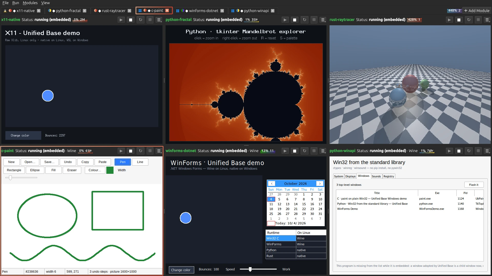

# Unified Base

A tabbed shell that hosts standalone GUI modules written in any of several
popular languages. Each module lives in its own project folder, gets its own
isolated environment, and runs as its own process — embedded into a tab when
possible. Embedding is window-based (X11 reparenting on Linux, `SetParent` on
Windows), so it works the same no matter what language a module is written in.

Runs on **Linux and Windows**, and each can host the other's apps: Windows
programs run on Linux through **Wine**, Linux programs run on Windows through
**WSL**. See [Cross-OS modules](#cross-os-modules).



## Download

Free and open source ([MIT](LICENSE)). Each download carries its own Python
and Qt, so there is nothing to install first.

- **Windows 10 1809+ / 11** — [UnifiedBase-windows-x64-setup.exe](https://github.com/frostbit82-Kai/unified-base/releases/latest/download/UnifiedBase-windows-x64-setup.exe).
  Installs for your user only, no admin. It is not code-signed yet, so
  SmartScreen may say *Windows protected your PC*: **More info ▸ Run anyway**.
- **Linux** (Mint 21+, Ubuntu 22.04+, Debian 12+) — [UnifiedBase-linux-x86_64.tar.gz](https://github.com/frostbit82-Kai/unified-base/releases/latest/download/UnifiedBase-linux-x86_64.tar.gz).
  Extract it and double-click **Install Unified Base**; installs to
  `~/.local`, no root.

Then **File ▸ Load Demo Modules** to see it work. All versions and SHA-256
sums: [Releases](https://github.com/frostbit82-Kai/unified-base/releases).
Setup guide: [bomsaisoftware.com/software/unified-base-guide](https://bomsaisoftware.com/software/unified-base-guide).
Questions and ideas go in [Discussions](https://github.com/frostbit82-Kai/unified-base/discussions);
bugs in [Issues](https://github.com/frostbit82-Kai/unified-base/issues), with
the output of the self-test (`unified-base --selftest`, or *Unified Base
Self-Test* in the Start menu).

## Supported runtimes

When you add a folder, the base detects its runtime (asking if more than one
matches) and installs/builds dependencies the same way a developer would.

**Toolchains fetch themselves on Linux.** If a module's language is missing,
or older than the project needs, its first start downloads a current one for
the user — no password — into `~/.unified_base/toolchains`, first on PATH for
every module from then on: Node.js 24 LTS, .NET SDK 10, Temurin JDK 25,
Maven 3.9, Rust (rustup, into `~/.cargo`) and, for Windows modules, Wine 11.
"Too old" is the general floor (Node 22.12, Rust 1.80, Wine 10) raised by
what the project declares: its `TargetFramework`, Maven/Gradle Java release,
`engines.node`, a v4 `Cargo.lock`, a `rust-version`. Each download is pinned
and SHA-256-checked (`USER_TOOLCHAINS` in `main.py`). LTS distros need this:
Mint 21 / Ubuntu 22.04 package Node 12, Rust 1.75, JDK 11 and no .NET 10.
PHP, Ruby and Docker still come from the package manager (the **Install**
button, which asks for a password); on Windows every Install button is winget.

| Runtime | Detected by | Set up with | Launched with |
|---|---|---|---|
| **Python** | `main.py`/`app.py`/… or any `.py` | venv + pip — or **uv** if installed (much faster). Deps from requirements files, `pyproject.toml` (PEP 621 / poetry), `requirements*.in`, and an AST import scan; `requirements.lock`/`.freeze` preferred when present | the venv's interpreter |
| **Node.js / Electron** | `package.json` | `npm install` | `npm start` / `npx electron .` / `node <main>` / an npm script |
| **Native binary** (Rust/Go/C/C++) | `Cargo.toml`, `go.mod`, `Makefile`, `CMakeLists.txt`, or an executable file | `cargo build --release` / `go build` / `make` / `cmake` | the built binary, or a prebuilt executable directly |
| **Java** | `pom.xml`, `build.gradle(.kts)`, or a `.jar` | `mvn package` / `gradle build` | `java -jar <jar>` |
| **Web app** | `package.json` with a dev server (Vite/Next/CRA/Vue/…) | `npm install` | `npm run dev`, then a Chromium-family browser in `--app` mode pointed at the detected URL, whose window is embedded |
| **C# / .NET** | `*.csproj` or `*.sln` | `dotnet restore` | `dotnet run [--project <csproj>]` |
| **Ruby** | `Gemfile`, `Rakefile`, or any `.rb` | `bundle install` (if Gemfile) | `ruby <script>` / `rake` |
| **PHP** | `composer.json`, `index.php`, or any `.php` | `composer install` (if composer.json) | `php <script>` / `php -S localhost:8000` |
| **Docker** | `Dockerfile` or `docker-compose.yml` | `docker build` | `docker run --rm <image>` / `docker-compose up` |

Per-module extras — right-click a tab: **Startup args…**, **Environment
variables…** (`EXTRA_PIP_PACKAGES` there adds manual pip deps), **Custom
commands…** (any other language), **Runs on ▸**.

Core logic has a self-check: `python3 test_core.py` (run inside `.venv`).

Per-tab **Rebuild Env** wipes the runtime's environment (venv for Python,
`node_modules` / `target` / `build` / etc. for the rest) and re-runs setup.

## Run from source

**Linux**

```bash
./run.sh
```

**Windows** — double-click `run.bat` (Windows 10 1809+ or 11, which current
Qt requires; needs Python 3 — if missing:
`winget install -e --id Python.Python.3.13`).

First run creates `.venv/` and installs PySide6 plus python-xlib (Linux) or
psutil (Windows). No admin rights, no prompts — everything is user-level pip.

**Linux package** — `bash installer/build_linux.sh` builds a tarball that
carries its own Python and Qt: extract it and double-click *Install Unified
Base* (installs to `~/.local`, no root). See `installer/README.md`.

**Windows installer** — `py installer\build_windows.py` builds a per-user
`setup.exe` (no admin) that carries its own Python and Qt, with Start-menu
entries for the app, its self-test and *Set Up Linux Programs (WSL)*
(`setup-wsl.ps1`). See `installer/README.md`.

Check what works on a machine: `./run.sh --selftest` or `run.bat --selftest`.
It launches a small window, finds it, embeds it, stops it, and probes
Wine / WSL / winget / the browser.

## Cross-OS modules

A module records what it **needs** — runs anywhere, Linux only, or Windows
only — and the launcher picks how to run it on the current machine:

| Module needs | On Linux | On Windows |
|---|---|---|
| anywhere (most source projects) | native | native |
| **Windows only** (`.exe`, WinForms/WPF `.csproj`) | **Wine** | native |
| **Linux only** (ELF binary, GTK/X11 Python) | native | **WSL** |

Detection only trusts strong evidence: a binary's own header, a `.csproj`
targeting `-windows`, a `gi`/`Xlib` import, or a program that cannot start
anywhere but Windows (a module-level `import winreg`, Ruby's `unless
Gem.win_platform?`, Java FFM on `user32`, the `windows-sys` crate, a
Windows container base image). Override it per module with
right-click ▸ **Runs on**. The setting travels with the config, so a module
saved on one OS does the right thing when opened on the other.

A module bound to one OS shows a tiny mark on its tab — the Windows four
panes or a Tux — and hovering it says how it runs on this machine. Modules
that run anywhere get no mark.

**Wine (Linux running Windows apps).** Nothing to install: without a Wine 10
or newer, the first Windows module downloads Wine 11 (a portable wow64 build,
no 32-bit libraries needed; see above), then builds a shared
prefix at `~/.unified_base/wine/default`. Wine draws real X11 windows, so
Windows apps embed into panes exactly like Linux ones. Builds still run
natively — a Windows-only .NET app is published for `win-x64` by the Linux
SDK, and a Windows-only Rust crate is built for `x86_64-pc-windows-gnu` with
MinGW — then Wine runs the `.exe`. A Windows-only program in Python, Java
or Ruby runs on that language's official Windows build, which the first
start installs into the module's Wine prefix (`C:\ub\…`): Python 3.12
(26 MB), Temurin JDK 25 (135 MB; Maven still builds the jar on Linux),
Ruby 3.4 (20 MB, plus Microsoft's C runtime, 31 MB). Each download is pinned
and checked against its SHA-256 before it runs; later starts reuse it.
Windows-only Node.js or PHP programs, and Windows containers, get an
explanation instead.
Point a module at its own prefix by setting
`WINEPREFIX` in its Environment variables. Wine detaches every program a
Windows program starts (the app a `.bat` runs, the game a launcher opens);
the launcher tags each launch so Stop and the meters still reach them.

**WSL (Windows running Linux apps).** Set it up once with `setup-wsl.ps1`
(Start menu: *Set Up Linux Programs (WSL)*, or a Linux module's **Set up WSL**
button): it checks virtualization, installs WSL and Ubuntu, Python for Linux
modules, VcXsrv, and `networkingMode=mirrored` in `%USERPROFILE%\.wslconfig`,
asking before each change. Setup steps, the launch and the command bar all run
inside the default distro, through a login shell so its PATH is there; Python
modules get their venv in the distro's own home. Toolchains need to exist
*inside* the distro. Linux windows embed through VcXsrv, which the launcher
starts when a Linux module needs it; WSLg's own windows refuse to be embedded,
so without VcXsrv a Linux app opens in its own window beside the launcher.

## Adding a module

File → Add Module… (or the ＋ button) → pick the project folder. The base
detects the runtime (see the table above; if more than one matches it asks
which to use), then asks which entry to launch when there's a choice (an
entry script, an npm script, a build target, a `.jar`, …). For Python, if
the folder ships its own venv (`.venv`, `venv`, or `env`) the base uses it
directly — your working environment runs untouched — otherwise it creates a
private venv under `~/.unified_base/envs/<name>-<hash>/` and installs deps
from every `requirements*.txt` plus a recursive AST import scan (names mapped
to PyPI packages, e.g. `cv2` → `opencv-python`; extend `PYPI_ALIASES` in
`main.py`). Other runtimes install/build via their own tooling. The module
then launches and its window is embedded into the tab.

File → Scan Folder for Modules… bulk-adds every subfolder whose runtime the
base recognizes (tabs are added stopped — start them as needed).

Right-click a tab → "Scan for Sub-modules…" lists the other runnable entries
in that module's folder (Python: `.py` files with a `__main__` guard;
Node/web: additional `package.json` scripts); check the ones you want and
each opens as a new tab, sharing the parent's runtime and settings.

## Display modes — Merge vs Independent

The merge area lives in a scroll view, so loading several modules **scrolls**
instead of squishing them: each pane keeps a minimum size and the base window
stays a sane shape. Each module is either:

- **Merge** (default) — shown alongside the other merge-mode modules in one
  of two arrangements (View menu):
  - **Single row (scroll →)** — a resizable row; drag the handles to size
    panes, **View → Even out panes** redistributes them, and a horizontal
    scrollbar appears once the panes exceed the window width.
  - **Grid / rows (scroll ↓)** — panes wrap into rows and the view scrolls
    vertically. **View → Grid columns** sets a fixed column count or
    *Auto-fit* (as many as fit the width).
  - **View → Pane minimum size** (Small / Medium / Large) controls how small
    a pane may get before the view scrolls instead.
- **Independent** — fills the entire base window on its own (no scrollbars);
  the other modules are hidden until you switch back to one of them.

Toggle a module between Merge and Independent from its **tab right-click
menu** ("Independent (fills window)") or from **Modules → Tab Display Mode**.
The tab bar always stays visible for switching/closing/reordering; selecting
an independent tab gives it the whole window, selecting any merge tab brings
back the merged view.

Double-click a tab to rename it, or right-click for Rename / Save to
Modules / Close plus three per-module toggles: **Independent (fills
window)** (above), **Embed window** (off = module always opens its own
window, no embed wait) and **Use shared environment**
(module runs from one shared venv at `~/.unified_base/envs/_shared/` instead
of a private one — handy when many modules need heavy deps like PyQt6;
takes effect on next start). The dependency scanner also catches dynamic
imports (`__import__("x")`, `importlib.import_module("x")` with literal
names). Closing a tab removes the module from the base (folder and
venv stay on disk). Open tabs persist in `~/.unified_base/modules.json`.

**Modules menu** — right-click a tab → "Save to Modules" to keep it in the
library (`~/.unified_base/library.json`); the Modules menu then opens it in
one click (or removes it via Remove Saved Module).

**Layouts** — File → Save Layout As… stores the current set of tabs (order
and names included) under a custom name; File → Load Layout restores and
starts them, File → Delete Layout removes one. Stored in
`~/.unified_base/layouts.json`.

Per-tab controls: Start / Stop / Restart, Rebuild Env (wipes and recreates
the venv), Embed (retry pulling a running module's window into the tab),
and a Logs toggle showing live stdout/stderr.

## Wayland / embedding notes

True in-tab embedding needs X11 window ids, so the base forces itself and
every module through XWayland (`QT_QPA_PLATFORM=xcb`, plus `GDK_BACKEND=x11`
and `SDL_VIDEODRIVER=x11` for non-Qt modules). If a module never produces an
embeddable window within ~40 s, its tab automatically degrades to a control
panel (logs + buttons) and the module runs as its own window.

Window lookup uses python-xlib, with `xdotool` as an optional fallback.
Primary matching is by `_NET_WM_PID`; for modules that never set it (common
with SDL/OpenGL apps), the base snapshots existing windows at launch and
falls back to embedding the new app-like window that appears afterward.

Once embedded, the host **self-heals**: a short stabilization timer plus
show/resize handlers re-parent the child back under the tab whenever it
drifts. Drift happens when Qt recreates the tab's native window (e.g. a
sibling pane's layout changes when you open a second module) or when the
window manager re-grabs a freshly mapped window into its own frame — this
was the cause of "first module docks, the rest float outside." If a window
is genuinely destroyed and recreated during init, the base re-scans (up to
8 rounds); only if it truly can't keep the window docked does the tab fall
back to panel mode. (The old Qt-container fallback was removed: on xcb it
silently no-ops, reporting success while leaving the window outside.)

Set `UNIFIED_BASE_NATIVE=1` to skip the xcb forcing (embedding off).

## Testing

```bash
QT_QPA_PLATFORM=offscreen .venv/bin/python test_core.py
```

Demo modules live in `demo_module/Linux/` and `demo_module/Windows/` — load
them from **File ▸ Load Demo Modules**. Besides one demo per runtime there are
deliberately single-OS ones to exercise the bridges: `Windows/win32-native`
(plain Win32 C), `Windows/winforms-dotnet` (.NET WinForms) and
`Linux/x11-native` (raw Xlib, statically linked so any WSL distro runs it).

## License

MIT — see [LICENSE](LICENSE). The installers also ship Qt and PySide6
(LGPL-3.0), python-xlib (LGPL-2.1+) and CPython (PSF); their licences are in
`installer/licenses/`.
